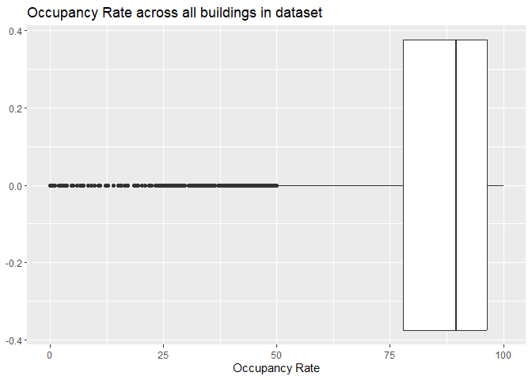
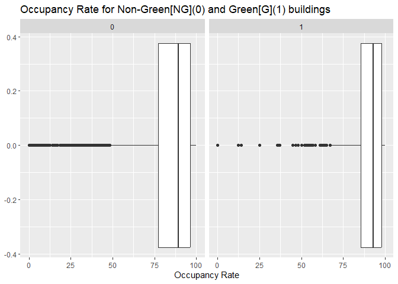
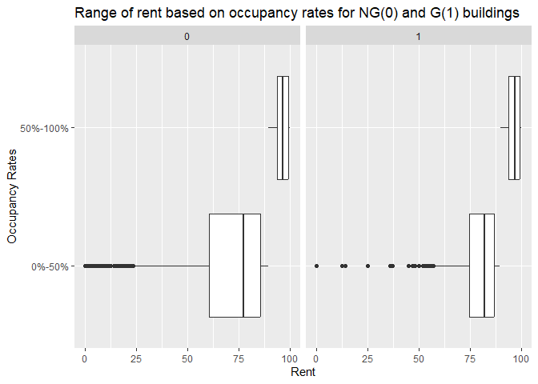

Green Buildings
================
Vaishnavi Ganesh

    ## ── Attaching core tidyverse packages ──────────────────────── tidyverse 2.0.0 ──
    ## ✔ dplyr     1.1.2     ✔ readr     2.1.4
    ## ✔ forcats   1.0.0     ✔ stringr   1.5.0
    ## ✔ ggplot2   3.4.2     ✔ tibble    3.2.1
    ## ✔ lubridate 1.9.2     ✔ tidyr     1.3.0
    ## ✔ purrr     1.0.1     
    ## ── Conflicts ────────────────────────────────────────── tidyverse_conflicts() ──
    ## ✖ dplyr::filter() masks stats::filter()
    ## ✖ dplyr::lag()    masks stats::lag()
    ## ℹ Use the conflicted package (<http://conflicted.r-lib.org/>) to force all conflicts to become errors
    ## corrplot 0.92 loaded
    ## 
    ## 
    ## Attaching package: 'zoo'
    ## 
    ## 
    ## The following objects are masked from 'package:base':
    ## 
    ##     as.Date, as.Date.numeric

### Green Buildings

#### Outlier marking:

The dataset has buildings that have a wide range in terms of different
features. Occupancy rates are something to consider because there are
buildings that have less than 10% occupancy rate and they might skew the
data under consideration, we have to check how occupancy rates are
distributed and check if we have to mark a few of them as outliers

<!-- --><!-- --><!-- -->

Findings:

- The occupancy rates of the buildings in the dataset fall within 0 to
  100, but the quantile range of 25 and 75 fall between 78% to 96%
  occupancy

- When we look at green and non-green buildings separately, the green
  buildings had only a few buildings that had a low occupancy rate but
  vice versa for non-green buildings

- Looking at rent for these occupancy rates between NG (non-green) and
  G(green) buildings, we see that the rent for non-green buildings with
  a lower occupancy rate was higher than green buildings

Since there is an impact of occupancy rate on green buildings as well as
the rent, it would be better to now mark any outliers based on this
variable as of now, but to proceed with the given dataset as it is.

#### Finding variables that may impact rent

To check the variables that impact rent, we see the number of features
that are correlated to rent positively or negatively so that we can
further dive deep into how further those features affect rent and filter
out the dataset so that we can arrive at the optimum set of buildings
that match the features of the client’s building

<!-- -->

Findings:

- From the correlation plot we can see that cluster, size, occupancy
  rate, stories, class_a, electricity_costs and cluster rent were
  positively correlated with rent

- Age, total number of degree days, class_b, renovated were negatively
  correlated with rent

Considering the information we have about the building - **size, age,
stories, class and occupancy rate** were relevant to filter for - so
that it is similar to the case of the building we are going for.

#### Filtering the dataset to get buildings similar to the specifications of the building to be constructed

Now that we have size, age, stories, class and occupancy rate as the
features of the interest, we check the range of each variable and filter
out the buildings that don’t fall within a certain range of the client’s
building.

    ##    Min. 1st Qu.  Median    Mean 3rd Qu.    Max. 
    ##    1624   50891  128838  234638  294212 3781045

<!-- -->

    ## `summarise()` has grouped output by 'green_rating'. You can override using the
    ## `.groups` argument.

    ## # A tibble: 6 × 4
    ## # Groups:   green_rating [2]
    ##   green_rating size_groups       median_rent     n
    ##          <int> <chr>                   <dbl> <int>
    ## 1            0 0-50th Quantile          24    3765
    ## 2            0 50-75th Quantile         27    1744
    ## 3            0 75-100th Quantile        24.8  1700
    ## 4            1 0-50th Quantile          28.2   177
    ## 5            1 50-75th Quantile         28.7   234
    ## 6            1 75-100th Quantile        26     274

    ##    Min. 1st Qu.  Median    Mean 3rd Qu.    Max. 
    ##    0.00   21.00   29.00   41.78   53.00  131.00

<!-- -->

    ## [1] 29

    ## `summarise()` has grouped output by 'green_rating'. You can override using the
    ## `.groups` argument.

    ## # A tibble: 4 × 4
    ## # Groups:   green_rating [2]
    ##   green_rating new_old median_rent     n
    ##          <int> <chr>         <dbl> <int>
    ## 1            0 New            30.2   788
    ## 2            0 Old            25     956
    ## 3            1 New            28.6   188
    ## 4            1 Old            29.9    46

    ##    Min. 1st Qu.  Median    Mean 3rd Qu.    Max. 
    ##    1.00    8.00   12.00   12.45   16.00   41.00

<!-- -->

    ## `summarise()` has grouped output by 'green_rating'. You can override using the
    ## `.groups` argument.

    ## [1] "\n"

    ## [1] "25th Quantile: 8"

    ## [1] "50th Quantile: 12"

    ## [1] "75th Quantile: 16"

    ## [1] "90th Quantile: 22"

    ## # A tibble: 10 × 4
    ## # Groups:   green_rating [2]
    ##    green_rating stories_groups    median_rent     n
    ##           <int> <chr>                   <dbl> <int>
    ##  1            0 0-25th Quantile          25.4   141
    ##  2            0 25-50th Quantile         35.4   207
    ##  3            0 50-75th Quantile         35.5   213
    ##  4            0 75-90th Quantile         25.6   130
    ##  5            0 90-100th Quantile        25.6    97
    ##  6            1 0-25th Quantile          25.6    58
    ##  7            1 25-50th Quantile         31.5    62
    ##  8            1 50-75th Quantile         31.8    41
    ##  9            1 75-90th Quantile         28.5    25
    ## 10            1 90-100th Quantile        21       2

Findings:

- The dataset had a very high range in terms of size and also affected
  rent, so filtered the dataset to keep it within the limits of the 50th
  quantile and 75th quantile range \[128838 sq.ft to 294212 sq.ft\]
  given that the building under consideration is estimated to be 250000
  sq.ft

- It also had a long range in terms of the age of the building, which
  also affected rent, so filtered the dataset to keep relatively new
  buildings below the median age of all buildings (29 years)

- The dataset had a range of buildings with 1 story to 41 stories, which
  affected rent as well, so filtered to keep buildings that have 12 to
  21 stories pertaining to the 50th and 90th quantiles respectively

#### Finding the rent of green and non-green buildings in the new filtered dataset

Now that we have the filtered the dataset to buildings within the
specific ranges, we focus on how much rent is being charged for those
types of buildings

    ## # A tibble: 2 × 3
    ##   g_or_ng   median_rent     n
    ##   <chr>           <dbl> <int>
    ## 1 Green            28.6    66
    ## 2 Non-Green        30     343

    ## [1] "Loss in rent per year = 350000"

<!-- --><!-- -->

    ## # A tibble: 2 × 3
    ##   g_or_ng   median_elec     n
    ##   <chr>           <dbl> <int>
    ## 1 Green          0.029     66
    ## 2 Non-Green      0.0327   343

<!-- -->

    ## `summarise()` has grouped output by 'g_or_ng'. You can override using the
    ## `.groups` argument.

    ## # A tibble: 5 × 4
    ## # Groups:   g_or_ng [2]
    ##   g_or_ng   Classes median_rent     n
    ##   <chr>     <chr>         <dbl> <int>
    ## 1 Green     Class A        31.8    59
    ## 2 Green     Class B        23.6     7
    ## 3 Non-Green Class A        33.2   242
    ## 4 Non-Green Class B        28.0    98
    ## 5 Non-Green Class C        29       3

<!-- -->

    ##    Min. 1st Qu.  Median    Mean 3rd Qu.    Max. 
    ##   22.36   87.13   92.73   88.28   96.77  100.00

<!-- -->

    ## `summarise()` has grouped output by 'g_or_ng'. You can override using the
    ## `.groups` argument.

    ## # A tibble: 4 × 4
    ## # Groups:   g_or_ng [2]
    ##   g_or_ng   occupancy_groups median_rent     n
    ##   <chr>     <chr>                  <dbl> <int>
    ## 1 Green     0%-50%                  27.9    36
    ## 2 Green     50%-100%                30.8    30
    ## 3 Non-Green 0%-50%                  28.4   168
    ## 4 Non-Green 50%-100%                33.8   175

<!-- -->

Findings:

- Looking at the median value of rent across all green and non-green
  buildings, green buildings have a lesser rent value compared to
  non-green buildings

- We check if electricity bill plays a role in the rent and as expected
  green buildings had a lesser electricity bill compared to non-green
  buildings

- When we look at the class and occupancy rates, we get similar results
  of green buildings having a lesser value than non-green buildings
  irrespective of the class or the occupancy rate

#### Recommendation:

Though green buildings are looked at positively at an environment
perspective, in an economical standpoint, building a green building
would not only increase the construction costs, but also produce lesser
rent compared to non-green buildings, leading to a loss of 5 million
dollars during construction along with a loss in rent of 350,000 dollars
per year. Therefore constructing a non-green better is going to yield
more profits from an economic point of view
